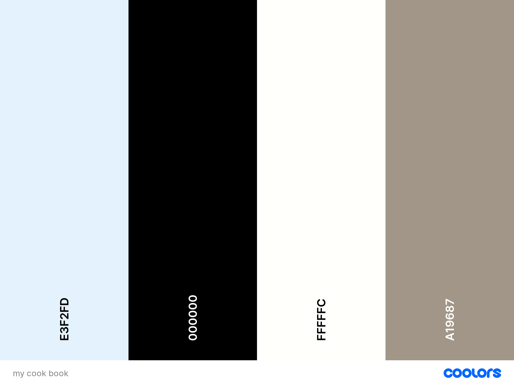

# My Cookbook

## Description

My Cookbook is a web-based platform designed to help users organize and manage their recipes effectively. With My Cookbook, users can register, log in, and add their favorite recipes to their personal collection. Whether you're a culinary enthusiast or a casual home cook, My Cookbook provides a convenient way to store and access your recipes anytime, anywhere.

## Table of Contents

- [UX](#ux "UX")
    - [User Goals](#user-goals "User Goals")
    - [User Stories](#user-stories "User Stories")
    - [Site Owners Goals](#site-owners-goals)
        - [Requirements](#requirements)
        - [Expectations](#expectations)
    - [Design Choices](#design-choices)
        - [Fonts](#fonts)
        - [Colours](#colours)
        - [Structure](#structure)
    - [Wireframes](#wireframes)
        - [Deployment](#deployment)
    - [Features](#features)
        - [Existing Features](#existing-features)
            - [Landing Page](#landing-page)
            - [Testing](#testing)
    - [Tech Stacks](#tech-stacks)
        - [Languages](#languages)
        - [Tools](#tools)
    - [Credits](#credits)
    
## UX

### User Goals
- Add Recipes: Users can add new recipes to their collection.
- Edit Recipes: Users can edit existing recipes.
- Delete Recipes: Users can delete recipes they no longer need.
- Search Recipes: Users can search for specific recipes.
- Organize Recipes: Users can categorize recipes for easy access.

### User Stories
- As a cooking enthusiast, I want to organize my recipes in one place.
- As a busy parent, I want to quickly access my favorite recipes while cooking.
- As a chef, I want to share my recipes with others in an organized manner.

### Site Owners Goals
- Provide a user-friendly interface for recipe management.
- Encourage users to engage with the platform regularly.
- Collect feedback from users to improve the platform continuously.
- Expand the platform with new features based on user needs.

#### Requirements
- Web Browser: The application can be accessed via any modern web browser.
- Internet Connection: The platform requires an internet connection to access and manage recipes.

#### Expectations
- Easy Recipe Management: Users can easily add, edit, and delete recipes.
- Intuitive Interface: The platform features a clean and intuitive interface for seamless navigation.
- Responsive Design: The application is responsive and works well on various devices.

## Design Choices

### Fonts
- The platform uses Google Fonts for typography. The main font chosen is [Poppins](https://fonts.google.com/specimen/Poppins) for its readability and simplicity.

### Colours

### Structure
- The website follows a mobile-first approach with responsive design breakpoints based on Bootstrap breakpoints.

## Wireframes
- Wireframes were created using Balsamic for desktop, mobile, and tablet views to ensure a consistent user experience across different devices.

## Features

### Existing Features

#### Landing Page
- Provides an overview of the platform's features.
- Displays images representing various devices to emphasize accessibility.

#### Testing
- Ensures the platform meets the expected goals and requirements.
- Validates HTML and CSS for correctness and compliance.
- Uses Lighthouse for performance testing on desktop and mobile devices.

## Deployment
- The repository was deployed to Heroku for hosting and accessibility.
- Changes can be made and deployed by following simple steps outlined in the README.

## Tech Stacks

### Languages
- HTML
- CSS
- Python
- Flask
- MongoDB

### Tools
- Gitpod: Integrated development environment for coding.
- Balsamic: Wireframing tool for designing user interfaces.
- W3C HTML Validation Service: Validates HTML code for compliance.
- W3C CSS Validation Service: Validates CSS code for compliance.
- materializecss: Front-end and back-end framework for responsive design.
- Google Fonts: Provides a wide range of fonts for typography.

## Credits
- Content and style inspiration: Pexels

## Conclusion
- The platform aims to provide users with a seamless experience for managing their recipes.
- Regular testing and updates ensure the platform remains functional and user-friendly.
- User feedback and suggestions are valuable for improving the platform's features and usability.
