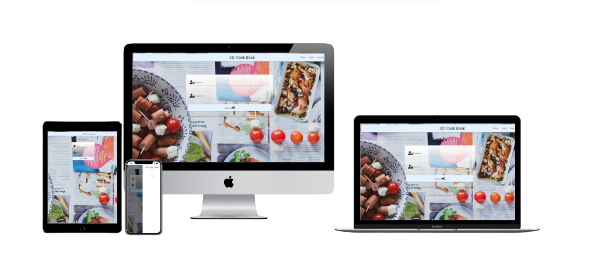

# My Cookbook

## Description

Welcome to My Cookbook! This platform is meticulously crafted to offer users a seamless experience in managing their culinary creations. From storing cherished family recipes to sharing culinary innovations with the world, My Cookbook empowers users to curate their personal cookbook with ease.

## Table of Contents

- [UX](#ux "UX")
    - [User Goals](#user-goals "User Goals")
    - [User Stories](#user-stories "User Stories")
    - [Site Owners Goals](#site-owners-goals)
        - [Requirements](#requirements)
        - [Expectations](#expectations)
    - [Design Choices](#design-choices)
        - [Fonts](#fonts)
        - [Colours](#colours)
        - [Structure](#structure)
    - [Wireframes](#wireframes)
        - [Deployment](#deployment)
    - [Features](#features)
        - [Existing Features](#existing-features)
            - [Landing Page](#landing-page)
            - [Testing](#testing)
    - [Tech Stacks](#tech-stacks)
        - [Languages](#languages)
        - [Tools](#tools)
    - [Credits](#credits)
    
## UX

### User Goals
- Efficiency: Streamline the process of storing and accessing recipes.
- Organization: Maintain a well-structured collection of recipes.
- Accessibility: Access recipes anytime, anywhere with an internet connection.
  
### User Stories
- Home Cook: "I want a convenient way to organize and access my favorite recipes, so I can spend more time enjoying my culinary creations."
- Busy Parent: "I need a platform that allows me to quickly find and prepare family-friendly recipes amidst my hectic schedule."
- Chef: "I aim to share my culinary expertise with others in an organized and professional manner, showcasing my unique recipes to a broader audience."

### Site Owners Goals
- Provide a user-friendly interface for recipe management.
- Encourage users to engage with the platform regularly.
- Collect feedback from users to improve the platform continuously.
- Expand the platform with new features based on user needs.

#### Requirements
- Web Browser: The application can be accessed via any modern web browser.
- Internet Connection: The platform requires an internet connection to access and manage recipes.

#### Expectations
- Easy Recipe Management: Users can easily add, edit, and delete recipes.
- Intuitive Interface: The platform features a clean and intuitive interface for seamless navigation.
- Responsive Design: The application is responsive and works well on various devices.

## Design Choices

### Fonts
- The platform uses Google Fonts for typography. The main font chosen is [Poppins](https://fonts.google.com/specimen/Poppins) for its readability and simplicity.

### Colours

### Structure
- The website follows a mobile-first approach with responsive design breakpoints based on Bootstrap breakpoints.

## Wireframes
- Wireframes were created using Balsamic for desktop, mobile, and tablet views to ensure a consistent user experience across different devices.

  

## Features

- Recipe Management: Add, edit, and delete recipes effortlessly.
- Search Functionality: Quickly find specific recipes using the search feature.
- Categorization: Organize recipes into custom categories for easy browsing.
- User Authentication: Securely register and log in to access your personalized cookbook.
- Responsive Design: Enjoy a consistent experience across various devices.

### Existing Features

### Navigation Bar

+ The navigation bar is fully responsive to allow for various screen sizes. It includes links to manoeuvre around the site easily and the Gym logo which doubles as a link back to the home screen.

+ Small devices (<992px)

+ As the navigation bar would be unuseable in the desktop version on smaller devices, it takes on a hamburger style.

### Landing Page

+ The landing page image gives the user instant knowledge of what is involved in the Gym amd a good motivation to scroll down to find out more.

### About Section

+ The about section gives a description of the type of classes, membership prices and some offers that will find at the Gym.
+ It is also responsive to suit the different screen sizes.
 

### Classes Section

+ The classes section gives am idea about the type of classesexiste at the Gym  and a dropdown buttom, when pressed  open up with small descripition of class.

### Gallery Section

+ The gallery section show a slideshow of pictures of the Gym.

### Contact Section

+ The contact section allows the user to quickly send a message to the Gym.

### Footer Section

+ The footer contains the social media links related to Gym.
+ These social links all open in a new tab for ease of use to the user and also, so the user has an ability to easily come back to Gym's site.
 

#### Landing Page
- Provides an overview of the platform's features.
- Displays images representing various devices to emphasize accessibility.

#### Testing
- Ensures the platform meets the expected goals and requirements.
- Validates HTML and CSS for correctness and compliance.
- Uses Lighthouse for performance testing on desktop and mobile devices.

## Deployment
- The repository was deployed to Heroku for hosting and accessibility.
- Now the website is now live on [(https://mycookbook-dfb04675e4fd.herokuapp.com/)]

- Changes can be made and deployed by following simple steps outlined in the README.

## Tech Stacks

### Languages
- Frontend: HTML, CSS
- Backend: Python, Flask
- Database: MongoDB

### Tools
- Gitpod: Integrated development environment for coding.
- Balsamic: Wireframing tool for designing user interfaces.
- W3C HTML Validation Service: Validates HTML code for compliance.
- W3C CSS Validation Service: Validates CSS code for compliance.
- Materialize CSS: Front-end and back-end framework for responsive design.
- Google Fonts: Provides a wide range of fonts for typography.

## Credits
- Content and style inspiration: Pexels

## Conclusion
- The platform aims to provide users with a seamless experience for managing their recipes.
- Regular testing and updates ensure the platform remains functional and user-friendly.
- User feedback and suggestions are valuable for improving the platform's features and usability.
